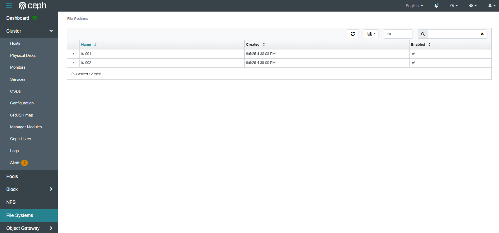
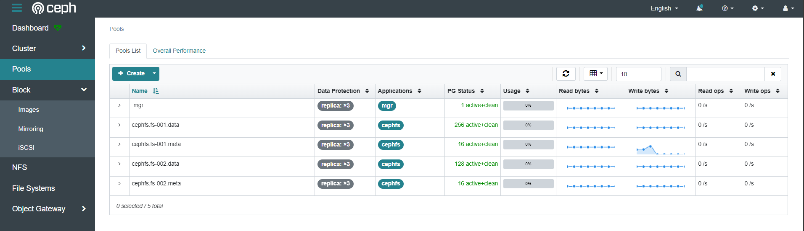
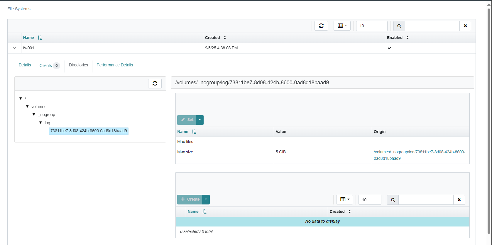
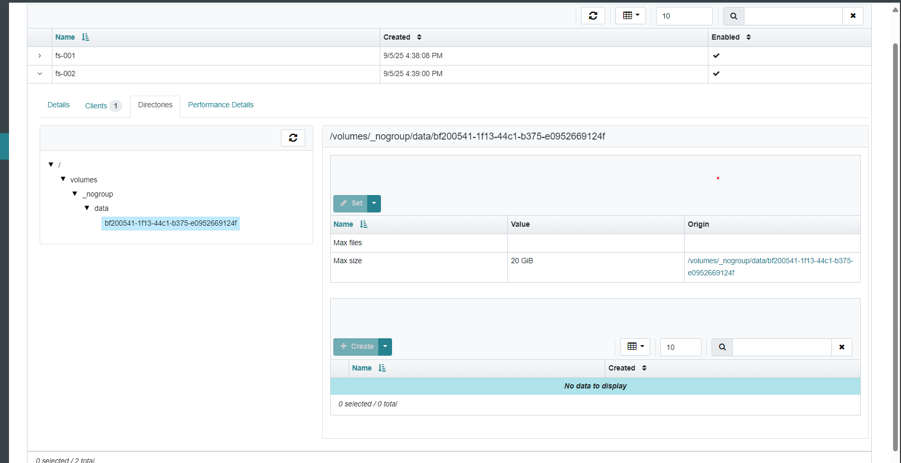

# Deploy Ceph Filesystem
*https://docs.ceph.com/en/latest/cephadm/services/mds/#orchestrator-cli-cephfs*

## Create file system volume
```
# ceph fs volume create <fs_name> --placement="<placement spec>"

Example:
root@node-mon01:/home/ubuntu# ceph fs volume create fs-001 --placement="count:3"
root@node-mon01:/home/ubuntu# ceph fs volume create fs-002 --placement="node-mon03,node-mon04,node-mon05"
```

```
root@node-mon01:/home/ubuntu# ceph orch ls
NAME                       PORTS        RUNNING  REFRESHED  AGE   PLACEMENT                         
alertmanager               ?:9093,9094      1/1  65s ago    6h    count:1                           
crash                                       6/6  67s ago    6h    *                                 
grafana                    ?:3000           1/1  65s ago    6h    count:1                           
mds.fs-001                                  3/3  67s ago    74s   count:3                           
mds.fs-002                                  3/3  14s ago    22s   node-mon03;node-mon04;node-mon05  
mds.main                                    6/6  67s ago    12m   *                                 
mgr                                         3/3  67s ago    4h    node-mon01;node-mon02;node-mon03  
mon                                         5/5  67s ago    6h    count:5                           
node-exporter              ?:9100           6/6  67s ago    6h    *                                 
osd.all-available-devices                     6  67s ago    106m  *                                 
prometheus                 ?:9095           1/1  65s ago    6h    count:1

root@node-mon01:/home/ubuntu# ceph fs ls
name: fs-001, metadata pool: cephfs.fs-001.meta, data pools: [cephfs.fs-001.data ]
name: fs-002, metadata pool: cephfs.fs-002.meta, data pools: [cephfs.fs-002.data ]

root@node-mon01:/home/ubuntu# ceph fs volume ls
[
    {
        "name": "fs-001"
    },
    {
        "name": "fs-002"
    }
]
```



## Create file system subvolume and set quota limit size storage
> [TIP]
> The --size parameter is actually the number of bytes (<bytes>).
```
# ceph fs subvolume create <fs_name> <subvol_name> --size <bytes>

Example:
root@node-mon01:/home/ubuntu# ceph fs subvolume create fs-001 log --size 5368709120
root@node-mon01:/home/ubuntu# ceph fs subvolume create fs-002 data --size 21474836480

root@node-mon01:/home/ubuntu# ceph fs subvolume ls fs-001
[
    {
        "name": "log"
    }
]

root@node-mon01:/etc/ceph# ceph fs subvolume getpath fs-001 log
/volumes/_nogroup/log/73811be7-8d08-424b-8600-0ad8d18baad9
```



## Create authorize client restriction
*https://docs.ceph.com/en/latest/cephfs/client-auth/*

**Create authorize client restriction for fs-001**
| Client name | Caps | Permissons |   
| :--- | :--- |  :--- | 
| admin-fs001 | caps mds = "allow rw fsname=fs-001"<br>caps mon = "allow r fsname=fs-001"<br>caps osd = "allow rw tag cephfs data=fs-001" | Full permission for fs-001 |
```
root@node-mon01:/etc/ceph# ceph fs authorize fs-001 client.admin-fs001 / rw -o client.admin-fs001.keyring

root@node-mon01:/etc/ceph# ceph auth get client.admin-fs001
[client.admin-fs001]
	key = AQBrOr5oXVG4DhAAWII0Ujw8Q8orCp0BbttURQ==
	caps mds = "allow rw fsname=fs-001"
	caps mon = "allow r fsname=fs-001"
	caps osd = "allow rw tag cephfs data=fs-001"
```

| Client name | Caps | Permissions |   
| :--- | :--- |  :--- | 
| member-fs001 | caps mds = "allow r fsname=fs-001, allow rw fsname=fs-001 path=/data"<br>caps mon = "allow r fsname=fs-001"<br>caps osd = "allow rw tag cephfs data=fs-001" | Only full permission for path "/log" in fs fs-001 |
```
root@node-mon01:/etc/ceph# ceph fs authorize fs-001 client.member-fs001 / r /log rw

root@node-mon01:/etc/ceph# ceph auth get client.member-fs001
[client.member-fs001]
	key = AQCKPb5oosFnLxAAINRLh2UdsyVtp8E8v1ksuQ==
	caps mds = "allow r fsname=fs-001, allow rw fsname=fs-001 path=/data"
	caps mon = "allow r fsname=fs-001"
	caps osd = "allow rw tag cephfs data=fs-001"
```

| Client name | Caps | Permissions |   
| :--- | :--- |  :--- | 
| log-fs001 | caps mds = "allow r fsname=fs-001, allow rw fsname=fs-001 path=/volumes/_nogroup/log/73811be7-8d08-424b-8600-0ad8d18baad9"<br>caps mon = "allow r fsname=fs-001"<br>caps osd = "allow rw tag cephfs data=fs-001" | Only full permission for subvolume path "/volumes/_nogroup/log/73811be7-8d08-424b-8600-0ad8d18baad9" in fs fs-001 |
```
root@node-mon01:/home/ubuntu# ceph fs subvolume ls fs-001
[
    {
        "name": "log"
    }
]

root@node-mon01:/etc/ceph# ceph fs subvolume getpath fs-001 log
/volumes/_nogroup/log/73811be7-8d08-424b-8600-0ad8d18baad9

root@node-mon01:/etc/ceph# ceph fs authorize fs-001 client.log-fs001 / r /volumes/_nogroup/log/73811be7-8d08-424b-8600-0ad8d18baad9 rw

root@node-mon01:/etc/ceph# ceph auth get client.log-fs001
[client.log-fs001]
	key = AQB8Wb5owPSrJhAAr7h4lK0/e6g/HvHVcujbJg==
	caps mds = "allow r fsname=fs-001, allow rw fsname=fs-001 path=/volumes/_nogroup/log/73811be7-8d08-424b-8600-0ad8d18baad9"
	caps mon = "allow r fsname=fs-001"
	caps osd = "allow rw tag cephfs data=fs-001"
```

## Mount filesystem for client and start storage data
https://docs.ceph.com/en/latest/man/8/mount.ceph/

| Mount Point| Mount Path | Client Auth |   
| :--- | :--- | :--- |
| / | /ceph-fs001-test/admin-auth | admin-fs001 |
| /data | /ceph-fs001-test/membem-auth | member-fs001 |

**Install ceph-common**
```
root@ceph-client:/home/ubuntu# apt-get update
root@ceph-client:/home/ubuntu# apt-get install ceph-common
root@ceph-client:/home/ubuntu# mkdir -p /ceph-fs001-test/{admin-auth,membem-auth}
root@ceph-client:/home/ubuntu# touch /etc/ceph/ceph.keyring && chmod 600 /etc/ceph/ceph.keyring
```

**Config ceph authorize**
> [!NOTE]
> Use command "ceph auth get-key <client user>" to get secret key. Example: "ceph auth get-key client.admin-fs001"

```
--- Get content of file "/etc/ceph/ceph.conf" on 1 mon server node and paste to "/etc/ceph/ceph.conf" on client server or copy file to that ---
root@ceph-client:/home/ubuntu# vi /etc/ceph/ceph.conf
[global]
	fsid = b0c8c6be-8a07-11f0-8f49-7b896d8c3aba
	mon_host = [v2:172.31.24.155:3300/0,v1:172.31.24.155:6789/0] [v2:172.31.29.146:3300/0,v1:172.31.29.146:6789/0] [v2:172.31.17.150:3300/0,v1:172.31.17.150:6789/0] [v2:172.31.24.21:3300/0,v1:172.31.24.21:6789/0] [v2:172.31.17.124:3300/0,v1:172.31.17.124:6789/0]

--- Define client authorize infomation ---
root@ceph-client:/home/ubuntu# vi /etc/ceph/ceph.keyring
[client.admin-fs001]
	key = AQBrOr5oXVG4DhAAWII0Ujw8Q8orCp0BbttURQ==
[client.member-fs001]
	key = AQCKPb5oosFnLxAAINRLh2UdsyVtp8E8v1ksuQ==
```

**Test mount and verify**
```
root@ceph-client:~# mount -t ceph :/ /ceph-fs001-test/admin-auth -o name=admin-fs001

root@ceph-client:~# mkdir /ceph-fs001-test/admin-auth/data

root@ceph-client:~# mount -t ceph :/data /ceph-fs001-test/membem-auth/ -o name=member-fs001

root@ceph-client:~# mount | grep "ceph-fs001"
172.31.17.124:6789,172.31.17.150:6789,172.31.24.21:6789,172.31.24.155:6789,172.31.29.146:6789:/ on /ceph-fs001-test/admin-auth type ceph (rw,relatime,name=admin-fs001,secret=<hidden>,fsid=b0c8c6be-8a07-11f0-8f49-7b896d8c3aba,acl)
172.31.17.124:6789,172.31.17.150:6789,172.31.24.21:6789,172.31.24.155:6789,172.31.29.146:6789:/data on /ceph-fs001-test/membem-auth type ceph (rw,relatime,name=member-fs001,secret=<hidden>,fsid=b0c8c6be-8a07-11f0-8f49-7b896d8c3aba,acl)

root@ceph-client:~# df -h
Filesystem                                                                                           Size  Used Avail Use% Mounted on
/dev/root                                                                                             15G  2.6G   12G  18% /
tmpfs                                                                                                2.0G     0  2.0G   0% /dev/shm
tmpfs                                                                                                783M  868K  782M   1% /run
tmpfs                                                                                                5.0M     0  5.0M   0% /run/lock
/dev/xvda15                                                                                          105M  6.1M   99M   6% /boot/efi
tmpfs                                                                                                392M  4.0K  392M   1% /run/user/1000
172.31.17.124:6789,172.31.17.150:6789,172.31.24.21:6789,172.31.24.155:6789,172.31.29.146:6789:/       95G     0   95G   0% /ceph-fs001-test/admin-auth
172.31.17.124:6789,172.31.17.150:6789,172.31.24.21:6789,172.31.24.155:6789,172.31.29.146:6789:/data   95G     0   95G   0% /ceph-fs001-test/membem-auth

root@ceph-client:~# echo "12345" > /ceph-fs001-test/membem-auth/abc.txt

root@ceph-client:~# cat /ceph-fs001-test/membem-auth/abc.txt
12345

root@ceph-client:~# ls /ceph-fs001-test/admin-auth -la
total 4
drwxr-xr-x 4 root root    2 Sep  8 03:58 .
drwxr-xr-x 4 root root 4096 Sep  8 02:34 ..
drwxr-xr-x 2 root root    0 Sep  8 03:58 data
drwxr-xr-x 3 root root    2 Sep  8 03:04 volumes

root@ceph-client:~# ls /ceph-fs001-test/admin-auth/data/
abc.txt
```

## Mount subvolume for client and start storage data
> [!NOTE]
> Use command "ceph fs subvolume getpath <fs name> <subvolume name>" to get Sub volume mount point  . Example: "ceph fs subvolume getpath fs-001 log"

| Sub Volume Mount Point| Mount Path | Client Auth |   
| :--- | :--- | :--- |
| /volumes/_nogroup/log/73811be7-8d08-424b-8600-0ad8d18baad9 | /ceph-fs001-test/log-auth | log-fs001 |

**Install ceph-common**
```
root@ceph-client:/home/ubuntu# apt-get update
root@ceph-client:/home/ubuntu# apt-get install ceph-common
root@ceph-client:/home/ubuntu# mkdir /ceph-fs001-test/log-auth
root@ceph-client:/home/ubuntu# touch /etc/ceph/ceph.keyring && chmod 600 /etc/ceph/ceph.keyring
```

**Config ceph authorize**
> [!NOTE]
> Use command "ceph auth get-key <client user>" to get secret key. Example: "ceph auth get-key client.admin-fs001"
```
--- Get content of file "/etc/ceph/ceph.conf" on 1 mon server node and paste to "/etc/ceph/ceph.conf" on client server or copy file to that ---
root@ceph-client:/home/ubuntu# vi /etc/ceph/ceph.conf
[global]
	fsid = b0c8c6be-8a07-11f0-8f49-7b896d8c3aba
	mon_host = [v2:172.31.24.155:3300/0,v1:172.31.24.155:6789/0] [v2:172.31.29.146:3300/0,v1:172.31.29.146:6789/0] [v2:172.31.17.150:3300/0,v1:172.31.17.150:6789/0] [v2:172.31.24.21:3300/0,v1:172.31.24.21:6789/0] [v2:172.31.17.124:3300/0,v1:172.31.17.124:6789/0]

--- Define client authorize infomation ---
root@ceph-client:/home/ubuntu# vi /etc/ceph/ceph.keyring
[client.log-fs001]
	key = AQB8Wb5owPSrJhAAr7h4lK0/e6g/HvHVcujbJg==
```

**Test mount and verify**
```
root@ceph-client:~# mount -t ceph :/volumes/_nogroup/log/73811be7-8d08-424b-8600-0ad8d18baad9 /ceph-fs001-test/log-auth/ -o name=log-fs001

root@ceph-client:~# mount | grep "log-auth"
172.31.17.124:6789,172.31.17.150:6789,172.31.24.21:6789,172.31.24.155:6789,172.31.29.146:6789:/volumes/_nogroup/log/73811be7-8d08-424b-8600-0ad8d18baad9 on /ceph-fs001-test/log-auth type ceph (rw,relatime,name=log-fs001,secret=<hidden>,fsid=b0c8c6be-8a07-11f0-8f49-7b896d8c3aba,acl)

root@ceph-client:~# df -h /ceph-fs001-test/log-auth
Filesystem                                                                                                                                                Size  Used Avail Use% Mounted on
172.31.17.124:6789,172.31.17.150:6789,172.31.24.21:6789,172.31.24.155:6789,172.31.29.146:6789:/volumes/_nogroup/log/73811be7-8d08-424b-8600-0ad8d18baad9  5.0G     0  5.0G   0% /ceph-fs001-test/log-auth
```
