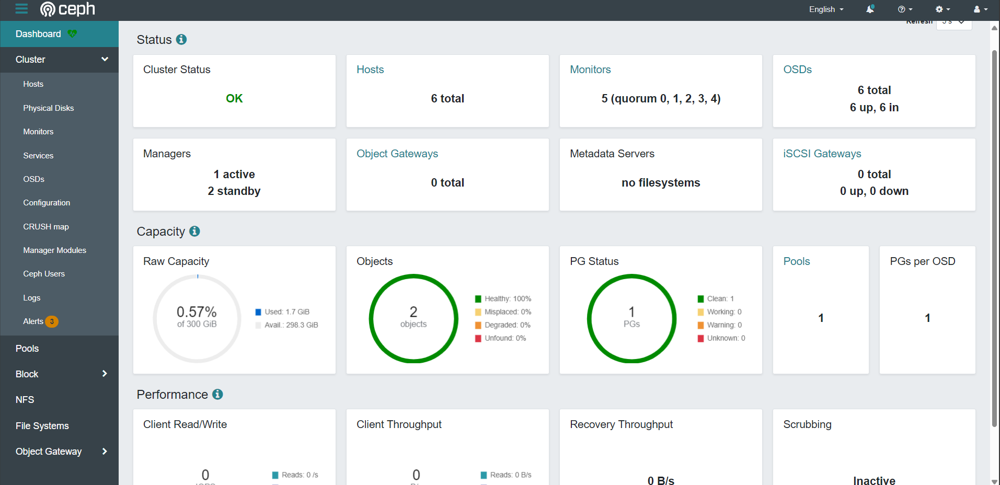

# Deploy Ceph cluster with cephadm
*Reference: https://docs.ceph.com/en/latest/cephadm/install/*
| Requirements |
| :--- |
| Python 3 |
| Systemd |
| Podman or Docker for running containers |
| Time synchronization (such as Chrony or the legacy ntpd) |
| LVM2 for provisioning storage devices |


## Lab info (6 servers - 5 mon + osd, 1 osd)
| Hostname | IP Address | OS | role | Label | Disk Device Storage Data (50 GB) |
| :--- | :--- | :--- | :--- | :--- | :--- |
| node-mon01 | 172.31.24.155  | Ubuntu 22.04.5 LTS | mon, osd, mgr, cluster-admin, mds | _admin | /dev/xvdb |
| node-mon02 | 172.31.29.146 | Ubuntu 22.04.5 LTS | mon, osd, mgr, cluster-admin, mds | _admin | /dev/xvdb |
| node-mon03 | 172.31.17.150  | Ubuntu 22.04.5 LTS | mon, osd, mgr, cluster-admin, mds | _admin | /dev/xvdb |
| node-mon04 | 172.31.24.21 | Ubuntu 22.04.5 LTS | mon, osd, mds | | /dev/xvdb |
| node-mon05 | 172.31.17.124 | Ubuntu 22.04.5 LTS | mon, osd, mds | | /dev/xvdb |
| node-osd01  | 172.31.25.57 | Ubuntu 22.04.5 LTS | osd, mds | | /dev/xvdb |

## Install & pre-config on all nodes
**Check timezone & NTP Time sync**
```
# timedatectl 
               Local time: Fri 2025-09-05 02:27:16 UTC
           Universal time: Fri 2025-09-05 02:27:16 UTC
                 RTC time: Fri 2025-09-05 02:27:16
                Time zone: Etc/UTC (UTC, +0000)
System clock synchronized: yes
              NTP service: active
          RTC in local TZ: no
```
```
# systemctl status chrony
● chrony.service - chrony, an NTP client/server
     Loaded: loaded (/lib/systemd/system/chrony.service; enabled; vendor preset: enabled)
     Active: active (running) since Fri 2025-09-05 02:14:12 UTC; 14min ago
       Docs: man:chronyd(8)
             man:chronyc(1)
             man:chrony.conf(5)
   Main PID: 477 (chronyd)
      Tasks: 2 (limit: 4670)
     Memory: 2.0M
        CPU: 104ms
     CGroup: /system.slice/chrony.service
             ├─477 /usr/sbin/chronyd -F 1
             └─501 /usr/sbin/chronyd -F 1

Sep 05 02:14:12 ip-172-31-24-155 systemd[1]: Starting chrony, an NTP client/server...
Sep 05 02:14:12 ip-172-31-24-155 chronyd[477]: chronyd version 4.2 starting (+CMDMON +NTP +REFCLOCK +RTC +PRIVDROP +SCFILTER +SIGND +ASYNCDNS +NTS +SECHASH +IPV6 -DEBUG)
Sep 05 02:14:12 ip-172-31-24-155 chronyd[477]: Using right/UTC timezone to obtain leap second data
Sep 05 02:14:12 ip-172-31-24-155 chronyd[477]: Loaded seccomp filter (level 1)
Sep 05 02:14:12 ip-172-31-24-155 systemd[1]: Started chrony, an NTP client/server.
Sep 05 02:14:19 ip-172-31-24-155 chronyd[477]: Selected source 169.254.169.123
Sep 05 02:14:19 ip-172-31-24-155 chronyd[477]: System clock TAI offset set to 37 seconds
```

**Set hostname**
```
# hostnamectl set-hostname <SERVER_HOSTNAME>

Example:
# hostnamectl set-hostname node-mon01
```

**Change default values system limit**
```
# vi /etc/systemd/system.conf
---
DefaultLimitNOFILE=65000
DefaultLimitNPROC=65000
DefaultTasksMax=65000
```

**Install Podman**
```
# apt-get update && apt-get install -y podman

# systemctl status podman
○ podman.service - Podman API Service
     Loaded: loaded (/lib/systemd/system/podman.service; enabled; vendor preset: enabled)
     Active: inactive (dead) since Fri 2025-09-05 02:27:09 UTC; 1min 42s ago
TriggeredBy: ● podman.socket
       Docs: man:podman-system-service(1)
    Process: 3475 ExecStart=/usr/bin/podman $LOGGING system service (code=exited, status=0/SUCCESS)
   Main PID: 3475 (code=exited, status=0/SUCCESS)
        CPU: 89ms

Sep 05 02:27:04 node-mon01 systemd[1]: Starting Podman API Service...
Sep 05 02:27:04 node-mon01 systemd[1]: Started Podman API Service.
Sep 05 02:27:04 node-mon01 podman[3475]: time="2025-09-05T02:27:04Z" level=info msg="/usr/bin/podman filtering at log level info"
Sep 05 02:27:04 node-mon01 podman[3475]: time="2025-09-05T02:27:04Z" level=info msg="Found CNI network podman (type=bridge) at /etc/cni/net.d/87-podman-bridge.conflist"
Sep 05 02:27:04 node-mon01 podman[3475]: 2025-09-05 02:27:04.504944434 +0000 UTC m=+0.323604301 system refresh
Sep 05 02:27:04 node-mon01 podman[3475]: time="2025-09-05T02:27:04Z" level=info msg="Setting parallel job count to 7"
Sep 05 02:27:04 node-mon01 podman[3475]: time="2025-09-05T02:27:04Z" level=info msg="using systemd socket activation to determine API endpoint"
Sep 05 02:27:04 node-mon01 podman[3475]: time="2025-09-05T02:27:04Z" level=info msg="using API endpoint: ''"
Sep 05 02:27:04 node-mon01 podman[3475]: time="2025-09-05T02:27:04Z" level=info msg="API service listening on \"/run/podman/podman.sock\""
Sep 05 02:27:09 node-mon01 systemd[1]: podman.service: Deactivated successfully.
```

**Check Python version**
```
# python3 -V
Python 3.10.12
```

**Check disk device**
```
# lsblk 
NAME     MAJ:MIN RM  SIZE RO TYPE MOUNTPOINTS
loop0      7:0    0 27.6M  1 loop /snap/amazon-ssm-agent/11797
loop1      7:1    0 63.8M  1 loop /snap/core20/2599
loop2      7:2    0 73.9M  1 loop /snap/core22/2045
loop3      7:3    0 89.4M  1 loop /snap/lxd/31333
loop4      7:4    0 49.3M  1 loop /snap/snapd/24792
xvda     202:0    0   20G  0 disk 
├─xvda1  202:1    0 19.9G  0 part /
├─xvda14 202:14   0    4M  0 part 
└─xvda15 202:15   0  106M  0 part /boot/efi
xvdb     202:16   0   50G  0 disk
```

**Install cephadm**
Check active release version. In current, active release version is "squid - 19.2.3"
```
# CEPH_RELEASE="19.2.3" && curl --silent --remote-name --location https://download.ceph.com/rpm-${CEPH_RELEASE}/el9/noarch/cephadm

# chmod +x cephadm

# ./cephadm install && which cephadm 
Installing packages ['cephadm']...
/usr/sbin/cephadm
```

**Install ceph-common**
```
# cephadm add-repo --release squid
Installing repo GPG key from https://download.ceph.com/keys/release.gpg...
Installing repo file at /etc/apt/sources.list.d/ceph.list...
Updating package list...
Completed adding repo.

# cephadm install ceph-common
Installing packages ['ceph-common']...

# ceph --version
ceph version 19.2.3 (c92aebb279828e9c3c1f5d24613efca272649e62) squid (stable)
```

## Bootstrap a new cluster (Perform in node-mon01)
**Bootrap mon node**
> [!NOTE]
> **Save user / password dashboard information to first login**

```
# cephadm bootstrap --mon-ip <IP server node-mon01>

Example:
root@node-mon01:~# cephadm bootstrap --mon-ip 172.31.24.155
...
...
...
Waiting for mgr epoch 9...
mgr epoch 9 is available
Generating a dashboard self-signed certificate...
Creating initial admin user...
Fetching dashboard port number...
Ceph Dashboard is now available at:

	     URL: https://ip-172-31-24-155.ap-southeast-1.compute.internal:8443/
	    User: admin
	Password: uywa2hmick

Enabling client.admin keyring and conf on hosts with "admin" label
Saving cluster configuration to /var/lib/ceph/b0c8c6be-8a07-11f0-8f49-7b896d8c3aba/config directory
Enabling autotune for osd_memory_target
You can access the Ceph CLI as following in case of multi-cluster or non-default config:

	sudo /usr/sbin/cephadm shell --fsid b0c8c6be-8a07-11f0-8f49-7b896d8c3aba -c /etc/ceph/ceph.conf -k /etc/ceph/ceph.client.admin.keyring

Or, if you are only running a single cluster on this host:

	sudo /usr/sbin/cephadm shell 

Please consider enabling telemetry to help improve Ceph:

	ceph telemetry on

For more information see:

	https://docs.ceph.com/docs/master/mgr/telemetry/

Bootstrap complete.
```
**Verify Podman container created by cephadm to running ceph component**
```
root@node-mon01:~# podman ps
CONTAINER ID  IMAGE                                                                                      COMMAND               CREATED        STATUS            PORTS       NAMES
cc0c779b5a32  quay.io/ceph/ceph:v17                                                                      -n mon.node-mon01...  3 minutes ago  Up 3 minutes ago              ceph-b0c8c6be-8a07-11f0-8f49-7b896d8c3aba-mon-node-mon01
3199e6a9bd95  quay.io/ceph/ceph:v17                                                                      -n mgr.node-mon01...  3 minutes ago  Up 3 minutes ago              ceph-b0c8c6be-8a07-11f0-8f49-7b896d8c3aba-mgr-node-mon01-wgmdkb
0f7b457f5992  quay.io/ceph/ceph@sha256:a0f373aaaf5a5ca5c4379c09da24c771b8266a09dc9e2181f90eacf423d7326f  -n client.crash.n...  3 minutes ago  Up 3 minutes ago              ceph-b0c8c6be-8a07-11f0-8f49-7b896d8c3aba-crash-node-mon01
b3b16c68853c  quay.io/prometheus/node-exporter:v1.5.0                                                    --no-collector.ti...  2 minutes ago  Up 2 minutes ago              ceph-b0c8c6be-8a07-11f0-8f49-7b896d8c3aba-node-exporter-node-mon01
1e099f07e85b  quay.io/prometheus/prometheus:v2.43.0                                                      --config.file=/et...  2 minutes ago  Up 2 minutes ago              ceph-b0c8c6be-8a07-11f0-8f49-7b896d8c3aba-prometheus-node-mon01
620f9990e553  quay.io/prometheus/alertmanager:v0.25.0                                                    --cluster.listen-...  2 minutes ago  Up 2 minutes ago              ceph-b0c8c6be-8a07-11f0-8f49-7b896d8c3aba-alertmanager-node-mon01
3dfc90a39819  quay.io/ceph/ceph-grafana:9.4.7                                                            /bin/bash             2 minutes ago  Up 2 minutes ago              ceph-b0c8c6be-8a07-11f0-8f49-7b896d8c3aba-grafana-node-mon01
```

**Check cluster status**
```
root@node-mon01:~# ceph -s
  cluster:
    id:     b0c8c6be-8a07-11f0-8f49-7b896d8c3aba
    health: HEALTH_WARN
            OSD count 0 < osd_pool_default_size 3
 
  services:
    mon: 1 daemons, quorum node-mon01 (age 7m)
    mgr: node-mon01.wgmdkb(active, since 6m)
    osd: 0 osds: 0 up, 0 in
 
  data:
    pools:   0 pools, 0 pgs
    objects: 0 objects, 0 B
    usage:   0 B used, 0 B / 0 B avail
    pgs:
```

**Check "mon" service placement (count:5) like default 5 mon node**
```
root@node-mon01:~# ceph orch ls
NAME           PORTS        RUNNING  REFRESHED  AGE  PLACEMENT  
alertmanager   ?:9093,9094      1/1  2m ago     15m  count:1    
crash                           1/1  2m ago     15m  *          
grafana        ?:3000           1/1  2m ago     15m  count:1    
mgr                             1/2  2m ago     15m  count:2    
mon                             1/5  2m ago     15m  count:5    
node-exporter  ?:9100           1/1  2m ago     15m  *          
prometheus     ?:9095           1/1  2m ago     15m  count:1
```

**Check cluster hosts**
```
root@node-mon01:~# ceph orch host ls --detail
HOST        ADDR           LABELS  STATUS  VENDOR/MODEL    CPU    RAM    HDD    SSD       NIC  
node-mon01  172.31.24.155  _admin          Xen (HVM domU)  2C/4T  4 GiB  2/0.0  8/75.5GB  1    
1 hosts in cluster
```

**Designating a Particular Subnet for Monitors**

*https://docs.ceph.com/en/latest/cephadm/services/mon/#deploy-additional-monitors*
```
# ceph config set mon public_network *<mon-cidr-network>*

Example:
root@node-mon01:~# ceph config set mon public_network 172.31.0.0/16
```

**Copy cluster’s public SSH key in the new host’s root user’s authorized_keys (Copy to all remain nodes)**
```
# ssh-copy-id -f -i /etc/ceph/ceph.pub root@*<new-host>*

Example:
root@node-mon01:~# ssh-copy-id -f -i /etc/ceph/ceph.pub root@172.31.29.146
root@node-mon01:~# ssh-copy-id -f -i /etc/ceph/ceph.pub root@172.31.17.150
root@node-mon01:~# ssh-copy-id -f -i /etc/ceph/ceph.pub root@172.31.24.21
root@node-mon01:~# ssh-copy-id -f -i /etc/ceph/ceph.pub root@172.31.17.124
root@node-mon01:~# ssh-copy-id -f -i /etc/ceph/ceph.pub root@172.31.25.57
```

**Adding Hosts join to cluster**
```

# ceph orch host add *<newhost>* [*<ip>*]  (To add host with lable (adding option --labels <label>))

Example:
root@node-mon01:~# ceph orch host add node-mon02 172.31.29.146 --labels _admin
root@node-mon01:~# ceph orch host add node-mon03 172.31.17.150 --labels _admin
root@node-mon01:~# ceph orch host add node-mon04 172.31.24.21
root@node-mon01:~# ceph orch host add node-mon05 172.31.17.124
root@node-mon01:~# ceph orch host add node-osd01 172.31.25.57
```

**Re-check cluster hosts and verify "mon" service node running**
```
root@node-mon01:~# ceph orch host ls --detail
HOST        ADDR           LABELS  STATUS  VENDOR/MODEL    CPU    RAM    HDD    SSD       NIC  
node-mon01  172.31.24.155  _admin          Xen (HVM domU)  2C/4T  4 GiB  2/0.0  8/75.5GB  1    
node-mon02  172.31.29.146  _admin          Xen (HVM domU)  2C/4T  4 GiB  2/0.0  8/75.5GB  1    
node-mon03  172.31.17.150  _admin          Xen (HVM domU)  2C/4T  4 GiB  2/0.0  8/75.5GB  1    
node-mon04  172.31.24.21                   Xen (HVM domU)  2C/4T  4 GiB  2/0.0  8/75.5GB  1    
node-mon05  172.31.17.124                  Xen (HVM domU)  2C/4T  4 GiB  2/0.0  8/75.5GB  1    
node-osd01  172.31.25.57                   Xen (HVM domU)  2C/4T  4 GiB  2/0.0  8/75.5GB  1    
6 hosts in cluster

root@node-mon01:~# ceph orch ls
NAME           PORTS        RUNNING  REFRESHED  AGE  PLACEMENT  
alertmanager   ?:9093,9094      1/1  2m ago     69m  count:1    
crash                           6/6  6m ago     69m  *          
grafana        ?:3000           1/1  2m ago     69m  count:1    
mgr                             2/2  6m ago     69m  count:2    
mon                             5/5  6m ago     69m  count:5    
node-exporter  ?:9100           6/6  6m ago     69m  *          
prometheus     ?:9095           1/1  2m ago     69m  count:1

root@node-mon01:~# ceph -s
  cluster:
    id:     b0c8c6be-8a07-11f0-8f49-7b896d8c3aba
    health: HEALTH_WARN
            OSD count 0 < osd_pool_default_size 3
 
  services:
    mon: 5 daemons, quorum node-mon01,node-mon02,node-mon03,node-mon04,node-mon05 (age 3m)
    mgr: node-mon01.wgmdkb(active, since 68m), standbys: node-mon02.mmxtwn
    osd: 0 osds: 0 up, 0 in
 
  data:
    pools:   0 pools, 0 pgs
    objects: 0 objects, 0 B
    usage:   0 B used, 0 B / 0 B avail
    pgs:
```

**Reschedule mgr service assing to admin cluster nodes (node-mon01, node-mon02, node-mon03)**
```
root@node-mon01:~# ceph orch apply mgr --placement="node-mon01,node-mon02,node-mon03"
Scheduled mgr update...

root@node-mon01:~# ceph orch ls
NAME           PORTS        RUNNING  REFRESHED  AGE  PLACEMENT                         
alertmanager   ?:9093,9094      1/1  0s ago     76m  count:1                           
crash                           6/6  9m ago     76m  *                                 
grafana        ?:3000           1/1  0s ago     76m  count:1                           
mgr                             3/3  3m ago     12s  node-mon01;node-mon02;node-mon03  
mon                             5/5  9m ago     76m  count:5                           
node-exporter  ?:9100           6/6  9m ago     76m  *                                 
prometheus     ?:9095           1/1  0s ago     76m  count:1

root@node-mon01:/home/ubuntu# ceph mgr services
{
    "dashboard": "https://172.31.24.155:8443/",
    "prometheus": "http://172.31.24.155:9283/"
}
```

## Adding Storage (OSD) (Perform in 1 cluster admin node)
**Check physical disk**
```
root@node-mon01:/home/ubuntu# ceph orch device ls
HOST        PATH       TYPE  DEVICE ID   SIZE  AVAILABLE  REFRESHED  REJECT REASONS  
node-mon01  /dev/xvdb  ssd              50.0G  Yes        37s ago                    
node-mon02  /dev/xvdb  ssd              50.0G  Yes        37s ago                    
node-mon03  /dev/xvdb  ssd              50.0G  Yes        37s ago                    
node-mon04  /dev/xvdb  ssd              50.0G  Yes        37s ago                    
node-mon05  /dev/xvdb  ssd              50.0G  Yes        37s ago                    
node-osd01  /dev/xvdb  ssd              50.0G  Yes        37s ago
```

**Consume any available and unused storage device**
```
root@node-mon01:/home/ubuntu# ceph config set mon mon_allow_pool_delete true
root@node-mon01:/home/ubuntu# ceph orch apply osd --all-available-devices
Scheduled osd.all-available-devices update...

root@node-mon01:/home/ubuntu# ceph osd df
ID  CLASS  WEIGHT   REWEIGHT  SIZE     RAW USE  DATA     OMAP    META     AVAIL    %USE  VAR   PGS  STATUS
 1    ssd  0.04880   1.00000   50 GiB  291 MiB  164 KiB   1 KiB  290 MiB   50 GiB  0.57  1.00    0      up
 3    ssd  0.04880   1.00000   50 GiB  291 MiB  616 KiB   1 KiB  290 MiB   50 GiB  0.57  1.00    1      up
 5    ssd  0.04880   1.00000   50 GiB  291 MiB  164 KiB   1 KiB  290 MiB   50 GiB  0.57  1.00    0      up
 0    ssd  0.04880   1.00000   50 GiB  291 MiB  616 KiB   1 KiB  290 MiB   50 GiB  0.57  1.00    1      up
 2    ssd  0.04880   1.00000   50 GiB  291 MiB  616 KiB   1 KiB  290 MiB   50 GiB  0.57  1.00    1      up
 4    ssd  0.04880   1.00000   50 GiB  291 MiB  164 KiB   1 KiB  290 MiB   50 GiB  0.57  1.00    0      up
                       TOTAL  300 GiB  1.7 GiB  2.3 MiB  10 KiB  1.7 GiB  298 GiB  0.57                   
MIN/MAX VAR: 1.00/1.00  STDDEV: 0

root@node-mon01:/home/ubuntu# ceph -s
  cluster:
    id:     b0c8c6be-8a07-11f0-8f49-7b896d8c3aba
    health: HEALTH_OK
 
  services:
    mon: 5 daemons, quorum node-mon01,node-mon02,node-mon03,node-mon04,node-mon05 (age 3h)
    mgr: node-mon01.wgmdkb(active, since 4h), standbys: node-mon02.mmxtwn, node-mon03.dssoxi
    osd: 6 osds: 6 up (since 2m), 6 in (since 3m)
 
  data:
    pools:   1 pools, 1 pgs
    objects: 2 objects, 449 KiB
    usage:   1.7 GiB used, 298 GiB / 300 GiB avail
    pgs:     1 active+clean

root@node-mon01:/home/ubuntu# ceph orch device ls
HOST        PATH       TYPE  DEVICE ID   SIZE  AVAILABLE  REFRESHED  REJECT REASONS                                                           
node-mon01  /dev/xvdb  ssd              50.0G  No         6m ago     Has a FileSystem, Insufficient space (<10 extents) on vgs, LVM detected  
node-mon02  /dev/xvdb  ssd              50.0G  No         6m ago     Has a FileSystem, Insufficient space (<10 extents) on vgs, LVM detected  
node-mon03  /dev/xvdb  ssd              50.0G  No         6m ago     Has a FileSystem, Insufficient space (<10 extents) on vgs, LVM detected  
node-mon04  /dev/xvdb  ssd              50.0G  No         6m ago     Has a FileSystem, Insufficient space (<10 extents) on vgs, LVM detected  
node-mon05  /dev/xvdb  ssd              50.0G  No         6m ago     Has a FileSystem, Insufficient space (<10 extents) on vgs, LVM detected  
node-osd01  /dev/xvdb  ssd              50.0G  No         6m ago     Has a FileSystem, Insufficient space (<10 extents) on vgs, LVM detected 
```

## Deploy MDS Service - CephFS (Perform in 1 cluster admin node)
*https://docs.ceph.com/en/latest/cephadm/services/mds/#orchestrator-cli-cephfs*
```
root@node-mon01:/home/ubuntu# ceph config set mon mon_allow_pool_delete true
root@node-mon01:/home/ubuntu# ceph fs volume create mds --placement="*"
```

## Access Ceph Dashboard
*URL Access: https://<MON_SERVER_IP>:8443*
> [!NOTE]
> **First login with user / password information in step "Bootstrap a new cluster"**


