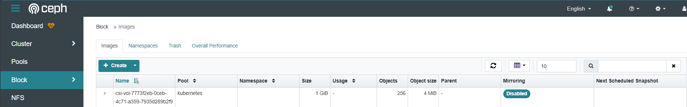
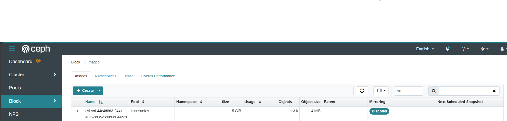

# Integrate CEPH-CSI with K8S
*https://docs.ceph.com/en/reef/rbd/rbd-kubernetes/*

## Create block device pool using for K8S (Perform in 1 ceph mon node)
```
root@node-mon01:/home/ubuntu# ceph osd pool create kubernetes
pool 'kubernetes' created

root@node-mon01:/home/ubuntu# ceph osd pool application enable kubernetes rbd
enabled application 'rbd' on pool 'kubernetes

root@node-mon01:/home/ubuntu# rbd pool init kubernetes
```
## Create a block device user using for K8S (Perform in 1 ceph mon node)
```
root@node-mon01:/home/ubuntu# ceph auth get-or-create client.kubernetes mon 'profile rbd' osd 'profile rbd pool=kubernetes' mgr 'profile rbd pool=kubernetes'
[client.kubernetes]
	key = AQDH5r9o/UKABRAAD0Oz3roseMT9sSD6cNBtRw==
```

## Collect the Ceph cluster unique fsid and the monitor addresses (Perform in 1 ceph mon node)
```
root@node-mon01:/home/ubuntu# ceph mon dump
epoch 5
fsid b0c8c6be-8a07-11f0-8f49-7b896d8c3aba
last_changed 2025-09-05T04:30:30.832262+0000
created 2025-09-05T03:23:34.207636+0000
min_mon_release 17 (quincy)
election_strategy: 1
0: [v2:172.31.24.155:3300/0,v1:172.31.24.155:6789/0] mon.node-mon01
1: [v2:172.31.29.146:3300/0,v1:172.31.29.146:6789/0] mon.node-mon02
2: [v2:172.31.17.150:3300/0,v1:172.31.17.150:6789/0] mon.node-mon03
3: [v2:172.31.24.21:3300/0,v1:172.31.24.21:6789/0] mon.node-mon04
4: [v2:172.31.17.124:3300/0,v1:172.31.17.124:6789/0] mon.node-mon05
dumped monmap epoch 5
```

## Generate ceph-csi manifest and auto deploy (Perform in k8s client)
**Prepare auto deploy script**
```
root@k8s-master01:~# mkdir -p /usr/local/src/ceph-csi-manifest; cd /usr/local/src/ceph-csi-manifest
root@k8s-master01:/usr/local/src/ceph-csi-manifest# wget https://raw.githubusercontent.com/vutrandn94/ceph-cluster-install/refs/heads/main/ceph-csi-install.sh
root@k8s-master01:/usr/local/src/ceph-csi-manifest# chmod +x ceph-csi-install.sh
```

**Edit environment variables below sector "## DEFINE ENV" in file "ceph-csi-install.sh"**
| VARIABLE NAME | DESCRIBE VALUE | Example |   
| :--- | :--- |  :--- |
| CLUSTER_ID | It's fsid value get in step [Collect the Ceph cluster unique fsid and the monitor addresses (Perform in 1 ceph mon node)] | b0c8c6be-8a07-11f0-8f49-7b896d8c3aba |
| CEPH_CLIENT_KEY | It's client key generated in step [Create a block device user using for K8S (Perform in 1 ceph mon node)] | AQDH5r9o/UKABRAAD0Oz3roseMT9sSD6cNBtRw== |
| K8S_NAMESPACE | K8S namespace you wanna ceph-csi component deploy in that | ceph-block-csi |
| MON_IP | It's mon ips and port "v1" get in step [Collect the Ceph cluster unique fsid and the monitor addresses (Perform in 1 ceph mon node)] | "172.31.24.155:6789","172.31.29.146:6789","172.31.17.150:6789","172.31.24.21:6789","172.31.17.124:6789" |
| STORAGE_CLASS | K8S storage class name you wanna define to interact with Ceph | ceph-csi-rbd |

> [!NOTE]
> Environment variables's value should contain by ''. Example: MON_IP='"172.31.24.155:6789","172.31.29.146:6789","172.31.17.150:6789","172.31.24.21:6789","172.31.17.124:6789"'

```
root@k8s-master01:/usr/local/src/ceph-csi-manifest# vi ceph-csi-install.sh
---
#!/bin/bash

## DEFINE ENV
CLUSTER_ID='b0c8c6be-8a07-11f0-8f49-7b896d8c3aba'
CEPH_CLIENT_KEY='AQDH5r9o/UKABRAAD0Oz3roseMT9sSD6cNBtRw=='
K8S_NAMESPACE='ceph-block-csi'
MON_IP='"172.31.24.155:6789","172.31.29.146:6789","172.31.17.150:6789","172.31.24.21:6789","172.31.17.124:6789"'
STORAGE_CLASS="ceph-csi-rbd"


```

**Deploy ceph-csi**
```
root@k8s-master01:/usr/local/src/ceph-csi-manifest# ./ceph-csi-install.sh 
namespace/ceph-block-csi created
configmap/ceph-config created
configmap/ceph-csi-config created
configmap/ceph-csi-encryption-kms-config created
serviceaccount/rbd-csi-nodeplugin created
clusterrole.rbac.authorization.k8s.io/rbd-csi-nodeplugin unchanged
clusterrolebinding.rbac.authorization.k8s.io/rbd-csi-nodeplugin unchanged
serviceaccount/rbd-csi-provisioner created
clusterrole.rbac.authorization.k8s.io/rbd-external-provisioner-runner unchanged
clusterrolebinding.rbac.authorization.k8s.io/rbd-csi-provisioner-role unchanged
role.rbac.authorization.k8s.io/rbd-external-provisioner-cfg created
rolebinding.rbac.authorization.k8s.io/rbd-csi-provisioner-role-cfg created
storageclass.storage.k8s.io/ceph-csi-rbd created
secret/csi-rbd-secret configured
service/csi-rbdplugin-provisioner created
deployment.apps/csi-rbdplugin-provisioner created
daemonset.apps/csi-rbdplugin created
service/csi-metrics-rbdplugin created
```

```
root@k8s-master01:/usr/local/src/ceph-csi-manifest# ls -la
total 88
drwxr-xr-x 3 root root  4096 Sep 10 13:58 .
drwxr-xr-x 4 root root  4096 Sep 10 11:30 ..
-rw-r--r-- 1 root root   301 Sep 10 13:58 ceph-config-map.yaml
-rwxr-xr-x 1 root root 24839 Sep 10 13:31 ceph-csi-install.sh
-rw-r--r-- 1 root root   356 Sep 10 13:58 csi-config-map.yaml
-rw-r--r-- 1 root root   143 Sep 10 13:58 csi-kms-config-map.yaml
-rw-r--r-- 1 root root  1207 Sep 10 13:58 csi-nodeplugin-rbac.yaml
-rw-r--r-- 1 root root  4082 Sep 10 13:58 csi-provisioner-rbac.yaml
-rw-r--r-- 1 root root   677 Sep 10 13:58 csi-rbd-sc.yaml
-rw-r--r-- 1 root root   171 Sep 10 13:58 csi-rbd-secret.yaml
-rw-r--r-- 1 root root  9388 Sep 10 13:58 csi-rbdplugin-provisioner.yaml
-rw-r--r-- 1 root root  7737 Sep 10 13:58 csi-rbdplugin.yaml
```

**Verify ceph-csi deployment and storageclass**
```
root@k8s-master01:/usr/local/src/ceph-csi-manifest# kubectl get pod -A -l app=csi-rbdplugin
NAMESPACE        NAME                  READY   STATUS    RESTARTS   AGE
ceph-block-csi   csi-rbdplugin-78vl7   3/3     Running   0          3m31s
ceph-block-csi   csi-rbdplugin-ttmxt   3/3     Running   0          3m31s

root@k8s-master01:/usr/local/src/ceph-csi-manifest# kubectl get pod -A -l app=csi-rbdplugin-provisioner
NAMESPACE        NAME                                         READY   STATUS    RESTARTS   AGE
ceph-block-csi   csi-rbdplugin-provisioner-6dcb96dfcf-6rwxl   7/7     Running   0          3m38s
ceph-block-csi   csi-rbdplugin-provisioner-6dcb96dfcf-7x6cj   7/7     Running   0          3m38s
ceph-block-csi   csi-rbdplugin-provisioner-6dcb96dfcf-dcq2j   7/7     Running   0          3m38s

root@k8s-master01:/usr/local/src/ceph-csi-manifest# kubectl get sc
NAME           PROVISIONER        RECLAIMPOLICY   VOLUMEBINDINGMODE   ALLOWVOLUMEEXPANSION   AGE
ceph-csi-rbd   rbd.csi.ceph.com   Delete          Immediate           true                   4m19s
```

## Test create PersistentVolumeClaim (PVC) with ceph-csi storageclass and mount to workload
> [!NOTE]
> If delete PersistentVolumeClaim (PVC) created with ceph-csi storageclass. Ceph Block Images volumes will too delete

**Test with "volumeMode: Filesystem"**
```
root@k8s-master01:/usr/local/src/ceph-csi-manifest# cat <<EOF | kubectl apply -f -
apiVersion: v1
kind: PersistentVolumeClaim
metadata:
  name: rbd-pvc
  namespace: default
spec:
  accessModes:
    - ReadWriteOnce
  volumeMode: Filesystem
  resources:
    requests:
      storage: 1Gi
  storageClassName: ceph-csi-rbd
---
apiVersion: v1
kind: Pod
metadata:
  name: csi-rbd-demo-pod
  namespace: default
spec:
  containers:
    - name: web-server
      image: nginx
      volumeMounts:
        - name: mypvc
          mountPath: /var/lib/www/html
  volumes:
    - name: mypvc
      persistentVolumeClaim:
        claimName: rbd-pvc
        readOnly: false
EOF

root@k8s-master01:/usr/local/src/ceph-csi-manifest# kubectl get pod -n default
NAME               READY   STATUS    RESTARTS   AGE
csi-rbd-demo-pod   1/1     Running   0          15s

root@k8s-master01:/usr/local/src/ceph-csi-manifest# kubectl get pvc -n default
NAME      STATUS   VOLUME                                     CAPACITY   ACCESS MODES   STORAGECLASS   VOLUMEATTRIBUTESCLASS   AGE
rbd-pvc   Bound    pvc-9318ce04-c5de-48e4-a955-7682f190f77b   1Gi        RWO            ceph-csi-rbd   <unset>                 17s

root@k8s-master01:/usr/local/src/ceph-csi-manifest# kubectl get pv
NAME                                       CAPACITY   ACCESS MODES   RECLAIM POLICY   STATUS   CLAIM             STORAGECLASS   VOLUMEATTRIBUTESCLASS   REASON   AGE
pvc-9318ce04-c5de-48e4-a955-7682f190f77b   1Gi        RWO            Delete           Bound    default/rbd-pvc   ceph-csi-rbd   <unset>                          21s

root@k8s-master01:/usr/local/src/ceph-csi-manifest# kubectl describe pv pvc-9318ce04-c5de-48e4-a955-7682f190f77b
Name:            pvc-9318ce04-c5de-48e4-a955-7682f190f77b
Labels:          <none>
Annotations:     pv.kubernetes.io/provisioned-by: rbd.csi.ceph.com
                 volume.kubernetes.io/provisioner-deletion-secret-name: csi-rbd-secret
                 volume.kubernetes.io/provisioner-deletion-secret-namespace: default
Finalizers:      [external-provisioner.volume.kubernetes.io/finalizer kubernetes.io/pv-protection external-attacher/rbd-csi-ceph-com]
StorageClass:    ceph-csi-rbd
Status:          Bound
Claim:           default/rbd-pvc
Reclaim Policy:  Delete
Access Modes:    RWO
VolumeMode:      Filesystem
Capacity:        1Gi
Node Affinity:   <none>
Message:         
Source:
    Type:              CSI (a Container Storage Interface (CSI) volume source)
    Driver:            rbd.csi.ceph.com
    FSType:            ext4
    VolumeHandle:      0001-0024-b0c8c6be-8a07-11f0-8f49-7b896d8c3aba-000000000000001b-7773f2eb-0ceb-4c71-a359-7935d289b2f9
    ReadOnly:          false
    VolumeAttributes:      clusterID=b0c8c6be-8a07-11f0-8f49-7b896d8c3aba
                           imageFeatures=layering
                           imageName=csi-vol-7773f2eb-0ceb-4c71-a359-7935d289b2f9
                           journalPool=kubernetes
                           pool=kubernetes
                           storage.kubernetes.io/csiProvisionerIdentity=1757487492782-4977-rbd.csi.ceph.com
Events:                <none>
```


**Test with "volumeMode: Block"**
```
root@k8s-master01:/usr/local/src/ceph-csi-manifest# cat <<EOF | kubectl apply -f -
apiVersion: v1
kind: PersistentVolumeClaim
metadata:
  name: raw-block-pvc
  namespace: default
spec:
  accessModes:
    - ReadWriteOnce
  volumeMode: Block
  resources:
    requests:
      storage: 5Gi
  storageClassName: ceph-csi-rbd
---
apiVersion: v1
kind: Pod
metadata:
  name: pod-with-raw-block-volume
  namespace: default
spec:
  containers:
    - name: fc-container
      image: fedora:26
      command: ["/bin/sh", "-c"]
      args: ["tail -f /dev/null"]
      volumeDevices:
        - name: data
          devicePath: /dev/xvdb
  volumes:
    - name: data
      persistentVolumeClaim:
        claimName: raw-block-pvc
EOF

root@k8s-master01:/usr/local/src/ceph-csi-manifest# kubectl get pod pod-with-raw-block-volume -n default
NAME                        READY   STATUS    RESTARTS   AGE
pod-with-raw-block-volume   1/1     Running   0          59s

root@k8s-master01:/usr/local/src/ceph-csi-manifest# kubectl get pvc raw-block-pvc -n default
NAME            STATUS   VOLUME                                     CAPACITY   ACCESS MODES   STORAGECLASS   VOLUMEATTRIBUTESCLASS   AGE
raw-block-pvc   Bound    pvc-2fe194c3-4541-415f-839c-5e38f1a682ec   5Gi        RWO            ceph-csi-rbd   <unset>                 76s

root@k8s-master01:/usr/local/src/ceph-csi-manifest# kubectl get pv pvc-2fe194c3-4541-415f-839c-5e38f1a682ec -n default
NAME                                       CAPACITY   ACCESS MODES   RECLAIM POLICY   STATUS   CLAIM                   STORAGECLASS   VOLUMEATTRIBUTESCLASS   REASON   AGE
pvc-2fe194c3-4541-415f-839c-5e38f1a682ec   5Gi        RWO            Delete           Bound    default/raw-block-pvc   ceph-csi-rbd   <unset>                          88s

root@k8s-master01:/usr/local/src/ceph-csi-manifest# kubectl describe pv pvc-2fe194c3-4541-415f-839c-5e38f1a682ec -n default
Name:            pvc-2fe194c3-4541-415f-839c-5e38f1a682ec
Labels:          <none>
Annotations:     pv.kubernetes.io/provisioned-by: rbd.csi.ceph.com
                 volume.kubernetes.io/provisioner-deletion-secret-name: csi-rbd-secret
                 volume.kubernetes.io/provisioner-deletion-secret-namespace: default
Finalizers:      [external-provisioner.volume.kubernetes.io/finalizer kubernetes.io/pv-protection external-attacher/rbd-csi-ceph-com]
StorageClass:    ceph-csi-rbd
Status:          Bound
Claim:           default/raw-block-pvc
Reclaim Policy:  Delete
Access Modes:    RWO
VolumeMode:      Block
Capacity:        5Gi
Node Affinity:   <none>
Message:         
Source:
    Type:              CSI (a Container Storage Interface (CSI) volume source)
    Driver:            rbd.csi.ceph.com
    FSType:            
    VolumeHandle:      0001-0024-b0c8c6be-8a07-11f0-8f49-7b896d8c3aba-000000000000001b-44c4d8d3-2441-40f3-8d35-9c0b0e0445c1
    ReadOnly:          false
    VolumeAttributes:      clusterID=b0c8c6be-8a07-11f0-8f49-7b896d8c3aba
                           imageFeatures=layering
                           imageName=csi-vol-44c4d8d3-2441-40f3-8d35-9c0b0e0445c1
                           journalPool=kubernetes
                           pool=kubernetes
                           storage.kubernetes.io/csiProvisionerIdentity=1757487492782-4977-rbd.csi.ceph.com
Events:                <none>
```

