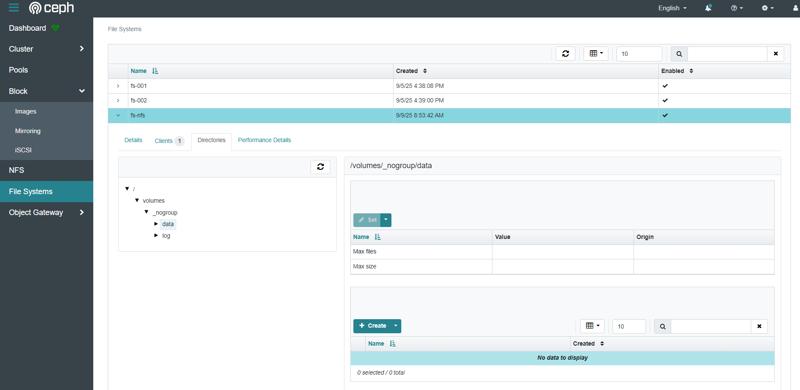
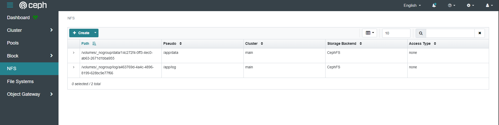

# Deploy NFS With Backend CephFS

*https://docs.ceph.com/en/latest/cephadm/services/nfs/*

## Deploy a NFS Ganesha gateway
**Listen default port 2049**
```
# ceph orch apply nfs <gateway_name> --placement="<placement_rule>"

Example:
root@node-mon01:~# ceph orch apply nfs main --placement="*"
```

**Custom port listen**
```
# ceph orch apply nfs <gateway_name> --port=<port_custom> --placement="*"

Example:
root@node-mon01:~# ceph orch apply nfs main --port=2049 --placement="count:3"
```

**Check gateway status after deploy**
```
root@node-mon01:~# ceph orch ls nfs
NAME      PORTS  RUNNING  REFRESHED  AGE  PLACEMENT  
nfs.main             6/6  14s ago    10m  *
```

## Create CephFS Backend for NFS
**Example create cephfs "fs-nfs" and 2 subvolume "data" and "log"
```
root@node-mon01:~# ceph fs volume create fs-nfs --placement="*"

root@node-mon01:~# ceph fs subvolume create fs-nfs data --size 5368709120

root@node-mon01:~# ceph fs subvolume create fs-nfs log --size 1073741824

root@node-mon01:~# ceph fs subvolume getpath fs-nfs data
/volumes/_nogroup/data/14c272f4-0ff3-4ec0-ab63-2671d1bba955

root@node-mon01:~# ceph fs subvolume getpath fs-nfs log
/volumes/_nogroup/log/a463769d-4a4c-4896-8199-628bc9e77f66
```


## Create NFS Export
```
# ceph nfs export create cephfs --cluster-id <cluster_id> --pseudo-path <pseudo_path> --fsname <fsname> [--readonly] [--path=/path/in/cephfs] [--client_addr <value>...] [--squash <value>] [--sectype <value>...] [--cmount_path <value>]
```
*https://docs.ceph.com/en/latest/mgr/nfs/#mgr-nfs*

> [!NOTE]
> Create nfs export with option "--client_addr" is limit only IPs specified can mount. If without use option "--client_addr", by default all clients can access the export according to specified export permissions

```
Example:
---
root@node-mon01:~# ceph nfs cluster ls
main

root@node-mon01:~# ceph nfs export create cephfs --cluster-id main --pseudo-path /app/data --fsname fs-nfs --path=/volumes/_nogroup/data/14c272f4-0ff3-4ec0-ab63-2671d1bba955 --client_addr 172.31.24.187,172.31.25.57
{
    "bind": "/app/data",
    "fs": "fs-nfs",
    "path": "/volumes/_nogroup/data/14c272f4-0ff3-4ec0-ab63-2671d1bba955",
    "cluster": "main",
    "mode": "none"
}

root@node-mon01:~# ceph nfs export create cephfs --cluster-id main --pseudo-path /app/log --fsname fs-nfs --path=/volumes/_nogroup/log/a463769d-4a4c-4896-8199-628bc9e77f66
{
    "bind": "/app/log",
    "fs": "fs-nfs",
    "path": "/volumes/_nogroup/log/a463769d-4a4c-4896-8199-628bc9e77f66",
    "cluster": "main",
    "mode": "RW"
}

root@node-mon01:~# ceph nfs export get main /app/data
{
  "export_id": 1,
  "path": "/volumes/_nogroup/data/14c272f4-0ff3-4ec0-ab63-2671d1bba955",
  "cluster_id": "main",
  "pseudo": "/app/data",
  "access_type": "none",
  "squash": "none",
  "security_label": true,
  "protocols": [
    4
  ],
  "transports": [
    "TCP"
  ],
  "fsal": {
    "name": "CEPH",
    "user_id": "nfs.main.1",
    "fs_name": "fs-nfs"
  },
  "clients": [
    {
      "addresses": [
        "172.31.24.187",
        "172.31.25.57"
      ],
      "access_type": "rw",
      "squash": "none"
    }
  ]
}

root@node-mon01:~# ceph nfs export get main /app/log
{
  "export_id": 2,
  "path": "/volumes/_nogroup/log/a463769d-4a4c-4896-8199-628bc9e77f66",
  "cluster_id": "main",
  "pseudo": "/app/log",
  "access_type": "RW",
  "squash": "none",
  "security_label": true,
  "protocols": [
    4
  ],
  "transports": [
    "TCP"
  ],
  "fsal": {
    "name": "CEPH",
    "user_id": "nfs.main.2",
    "fs_name": "fs-nfs"
  },
  "clients": []
}
```


## Mount NFS for client and start storage data
*https://docs.ceph.com/en/latest/cephfs/nfs/#cephfs-nfs*
> [!TIP]
> <ganesha-host-name> using to mount NFS exactly IP of 1 mon node

```
root@ceph-client:/home/ubuntu# apt install nfs-common -y

root@ceph-client:/home/ubuntu# mkdir -p /ceph-nfs-test/{log,data}

root@ceph-client:/home/ubuntu# mount -t nfs -o nfsvers=4.1,proto=tcp 172.31.24.155:/app/data /ceph-nfs-test/data/

root@ceph-client:/home/ubuntu# mount -t nfs -o nfsvers=4.1,proto=tcp 172.31.24.155:/app/log /ceph-nfs-test/log/

root@ceph-client:/home/ubuntu# df -h
Filesystem               Size  Used Avail Use% Mounted on
/dev/root                 15G  3.3G   12G  23% /
tmpfs                    2.0G     0  2.0G   0% /dev/shm
tmpfs                    783M  920K  782M   1% /run
tmpfs                    5.0M     0  5.0M   0% /run/lock
/dev/xvda15              105M  6.1M   99M   6% /boot/efi
/dev/rbd0                 10G  105M  9.9G   2% /ceph-rbd-test/rbd-pool-rw
/dev/rbd1                 50G  928K   50G   1% /ceph-rbd-test/rbd-pool-ro
tmpfs                    392M  4.0K  392M   1% /run/user/1000
172.31.24.155:/app/data  5.0G     0  5.0G   0% /ceph-nfs-test/data
172.31.24.155:/app/log   1.0G     0  1.0G   0% /ceph-nfs-test/log

root@ceph-client:/home/ubuntu# mount | grep /ceph-nfs-test/
172.31.24.155:/app/data on /ceph-nfs-test/data type nfs4 (rw,relatime,vers=4.1,rsize=1048576,wsize=1048576,namlen=255,hard,proto=tcp,timeo=600,retrans=2,sec=sys,clientaddr=172.31.24.187,local_lock=none,addr=172.31.24.155)
172.31.24.155:/app/log on /ceph-nfs-test/log type nfs4 (rw,relatime,vers=4.1,rsize=1048576,wsize=1048576,namlen=255,hard,proto=tcp,timeo=600,retrans=2,sec=sys,clientaddr=172.31.24.187,local_lock=none,addr=172.31.24.155)

root@ceph-client:/home/ubuntu# echo "123456" > /ceph-nfs-test/data/test.txt

root@ceph-client:/home/ubuntu# cat /ceph-nfs-test/data/test.txt
123456

root@ceph-client:/home/ubuntu# touch /ceph-nfs-test/log/abc.log

root@ceph-client:/home/ubuntu# ls -la /ceph-nfs-test/log
total 4
drwxr-xr-x 2 root root    0 Sep  9 02:41 .
drwxr-xr-x 4 root root 4096 Sep  9 02:23 ..
-rw-r--r-- 1 root root    0 Sep  9 02:41 abc.log
```

## Config /etc/fstab file to automount CephFS after server booted
```
root@ceph-client:/home/ubuntu# vi /etc/fstab
172.31.24.155:/app/data   /ceph-nfs-test/data   nfs   nfsvers=4.1,proto=tcp,_netdev   0 0
172.31.24.155:/app/log   /ceph-nfs-test/log   nfs   nfsvers=4.1,proto=tcp,_netdev   0 0
```
